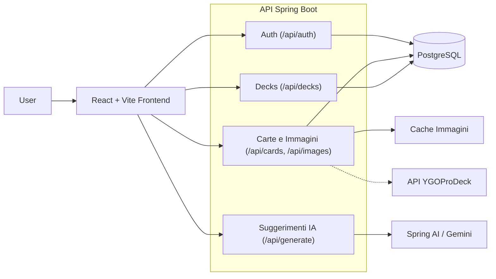

# DeckLab

[English](README.md) | **Italiano**

[](https://github.com/andrea-pugliatti/deck-lab/actions/workflows/ci.yml)
[](https://github.com/andrea-pugliatti/deck-lab/actions/workflows/deploy.yml)
[](LICENSE)

DeckLab è un Yu-Gi-Oh! deck builder full-stack, simulatore e strumento strategico progettato per aiutare i giocatori a costruire e affinare i propri deck in un unico flusso di lavoro. Provalo su [decklab.games](https://decklab.games). Il progetto combina un frontend in React + Vite con un backend in Spring Boot e persistenza PostgreSQL. Questa applicazione è stata creata come esperienza di apprendimento per esplorare pattern di sviluppo full-stack, Spring Boot, React e integrazioni con l'IA generativa.

## Funzionalità Chiave

- Deck builder con sezioni per Main, Extra e Side deck
- Validazione della legalità in tempo reale per vari formati
- Flussi assistiti dall'IA per la generazione di deck e suggerimenti di carte
- Ricerca delle carte con filtri per nome, archetipo, tipo, attributo e razza
- Simulatore di mano iniziale e analisi di consistenza del deck
- Autenticazione JWT con rotazione del refresh token e protezione contro il replay
- Configurazione di sviluppo Docker Compose per l'orchestrazione locale

## Stack Tecnologico

- **Backend**: Java 25, Maven, Spring Boot 4.1, Spring Data JPA, Spring Security, Spring AI (Integrazione Gemini)
- **Database**: PostgreSQL
- **Frontend**: React 19, Lucide React, TypeScript, Vite 8, Tailwind CSS 4, React Router 8, Oxlint (linting), Oxfmt (formattazione), pnpm
- **Test Frontend**: Vitest, React Testing Library
- **Test Backend**: JUnit, Mockito

---

## Anteprima

### Home Page


### Card Database


### Public Decks


### Deck Builder


### Hand Simulator


---

## Struttura delle Directory e Architettura

L'applicazione è organizzata in moduli distinti affinché il frontend e il backend rimangano focalizzati sulle proprie responsabilità:

```text
deck-lab/
├── .github/
│   └── workflows/
│       ├── ci.yml           # CI pipeline (backend/frontend build and tests)
│       └── deploy.yml       # CD pipeline (GCP deployment setup)
├── backend/
│   ├── src/main/java/
│   │   └── com/deck/lab/backend/
│   │       ├── config/          # Application configuration and startup setup
│   │       ├── controller/      # Auth, card, deck, and AI-related endpoints
│   │       ├── dto/             # Request/response payloads and validation models
│   │       ├── exception/       # Global exception handling and custom errors
│   │       ├── mapper/          # DTO-to-entity and entity-to-DTO mapping layers
│   │       ├── model/           # Core database entities (User, Card, Deck, RefreshToken)
│   │       ├── repository/      # Spring Data repositories and specifications
│   │       ├── security/        # JWT, filters, and authentication configuration
│   │       ├── seeder/          # Database seeders for cards, banlists, and sample users
│   │       ├── service/         # Business logic for decks, validation, and auth
│   │       │   └── generation/  # AI deck generation & suggestion module
│   │       │       ├── model/   # Mapped AI prompt & response schemas
│   │       │       ├── tool/    # Registered Spring AI function callbacks
│   │       │       └── tool/dto/# Payload requests/responses used by AI tools
│   │       └── validation/      # Deck legality and rule-validation engine
│   ├── src/main/resources/
│   │   ├── application.yml      # Core backend configuration
│   │   └── static/              # Static assets served by the backend
│   └── src/test/java/           # Backend unit and integration tests
├── frontend/
│   ├── src/assets/              # Static assets and global icons
│   ├── src/components/          # Reusable UI widgets and feature modules
│   │   ├── card/                # Card grid elements and filter sidebars
│   │   ├── deck/                # Deck grid items and card lists
│   │   ├── deck-builder/        # Deck editor, validation alerts, and AI suggestions
│   │   │   └── ai-wizard/       # AI deck builder wizard flow
│   │   ├── hand-simulator/      # Probability calculators and simulator workspace
│   │   └── ui/                  # Core input and display primitives
│   ├── src/context/             # Auth, catalog search, and deck state providers
│   ├── src/hooks/               # Custom hooks for URL sync, fetch lifecycle, and metadata access
│   ├── src/layouts/             # Route wrappers for authenticated and public layouts
│   ├── src/pages/               # High-level route entry points
│   ├── src/reducers/            # Reducers for deck editing and simulator state
│   ├── src/services/            # REST API clients and JWT helpers
│   ├── src/test/                # Vitest test environment and setup files
│   ├── src/types/               # Shared TypeScript interfaces and schemas
│   │   └── utils/               # Utility helpers for math, formatting, and themed visuals
├── bruno/                       # API request collection for local development
├── .env.example                 # Template for environment configuration variables
├── docker-compose.yml           # Local orchestration for db, backend, and frontend
├── LICENSE                      # MIT License file
└── README.md                    # Project overview and development guide
```

### Panoramica del Flusso di Richiesta



### Concetti Chiave

#### Gestione dello Stato

- Lo stato locale del componente viene utilizzato per comportamenti focalizzati della UI.
- Lo stato condiviso è gestito con React Context e reducers per la modifica dei deck, la simulazione della mano e lo stato di ricerca/query.
- Il frontend mantiene lo stato dell'esperienza utente leggero mentre il backend rimane la fonte per la persistenza e la validazione.

#### Hook Custom

- Gli hook di sincronizzazione dell'URL mantengono lo stato di ricerca e filtro nella barra degli indirizzi del browser in modo che la navigazione dei deck rimanga condivisibile e salvabile nei segnalibri.
- Gli hook di fetching incapsulano gli stati di caricamento ed errore per le chiamate API e le ricerche di metadati.

#### Validazione della Legalità del Deck

- **Pipeline di Validazione**: Il backend elabora i deck attraverso un motore di validazione contenente regole composite (`DeckRule`), come i limiti di quantità di carte (es. massimo 3 copie), posizionamenti corretti per tipo di carta (es. mostri Fusion/Synchro/Link nel Extra Deck) e confini delle dimensioni del deck (limiti per Main, Extra e Side deck).
- **Applicazione specifica del formato**: Il motore di validazione recupera dinamicamente le mappe di legalità dei formati dalle banlist del database (Advanced, Goat, Edison, ecc.) per verificare le restrizioni delle carte in tempo reale.

#### Suggerimenti e Generazione IA

- **Prompt Strutturati**: Il backend sfrutta il client chat di Spring AI per interfacciarsi con Gemini. Utilizza modelli di output strutturato per costruire deck list coese e suggerimenti di carte corrispondenti all'archetipo scelto dall'utente o ai vincoli di strategia.
- **Function Calling di Spring AI**: L'accesso al database esterno e alle regole di business è incapsulato tramite funzioni di callback registrate all'interno del sotto-pacchetto `tool/` (es. `CardSearchTool`, `CardDetailsTool`, `GetFormatRulesTool`, `GetArchetypeCardsTool` e `AnalyzeDeckStatsTool`), ciascuna delle quali utilizza parametri di richiesta/risposta isolati dal pacchetto `tool/dto/` per preservare i limiti di dimensione del contesto.
- **Ricerca Contestuale e Risoluzione**: Gli output dell'IA vengono mappati su DTO JSON strutturati definiti in `model/` (come `CardEntry` e `DeckGenerateAiResponse`) e risolti rispetto al database PostgreSQL locale utilizzando il `CardResolver` per garantire che i nomi delle carte generate esistano nel catalogo.

#### Seeding Asincrono e Graceful Shutdown

Per gestire in sicurezza l'importazione di grandi set di dati senza bloccare l'avvio dell'applicazione (particolarmente importante su piattaforme serverless come Google Cloud Run):

- **Avvio Non Bloccante**: Il seeding del database è delegato a un esecutore di task dedicato a thread singolo (`databaseSeederExecutor`) in modo che il thread principale possa associarsi rapidamente alla porta richiesta e superare i probe di avvio del container.
- **Validazione delle Immagini all'Avvio**: Anche se il database è già stato popolato con i record delle carte, il seeder scansiona tutti i record e li confronta con i file su disco. Le illustrazioni mancanti delle carte vengono messe in coda per il download in background in modo asincrono.
- **Interruzione Graduale**: Durante i ridimensionamenti (scale-down), le nuove distribuzioni o i riavvii dei container, l'hook `@PreDestroy` di Spring invia un segnale di interruzione al thread del seeder, consentendogli di arrestare in modo pulito eventuali cicli di recupero delle carte o scritture batch nel database.
- **Download Asincroni degli Artwork**: I download delle immagini sono gestiti da un pool `imageDownloadExecutor` configurato con un gestore di rifiuto `CallerRunsPolicy`. Questo applica una contropressione naturale al thread di seeding quando il pool è saturo e scarta in modo pulito le attività rimanenti all'arresto del contesto senza sollevare `RejectedExecutionException`.

---

## Per Iniziare

### Prerequisiti

- Docker o Podman
- Java JDK 25
- Node.js 22+ (testato con la versione 24 in CI)
- pnpm

### Configurazione dell'Ambiente

Prima di avviare l'applicazione, prepara la configurazione dell'ambiente:

```bash
cp .env.example .env
```

Il file `.env.example` contiene le seguenti variabili:

| Variabile            | Richiesta | Predefinito     | Descrizione                                   |
| -------------------- | --------- | --------------- | --------------------------------------------- |
| `POSTGRES_USER`      | No        | `postgres`      | Utente del database                           |
| `POSTGRES_PASSWORD`  | No        | `postgres`      | Password del database                         |
| `JWT_SECRET`         | No        | Chiave dev int. | Chiave di firma HMAC per i JWT                |
| `GEMINI_API_KEY`     | **Sì**    | —               | Chiave API per le funzionalità basate su IA   |
| `PRODUCTION_API_URL` | No        | —               | Necessaria solo per le pipeline di deployment |

### Sviluppo

#### Opzione 1: Avvia con Docker Compose

Dalla directory radice del repository:

```bash
docker compose up -d
```

Questo avvia:

- `db` — PostgreSQL 16
- `backend` — App Spring Boot sulla porta 8080 (carica le variabili da `.env`)
- `frontend` — Server di sviluppo Vite sulla porta 5173

##### Sviluppo in tempo reale con Compose Watch

L'ambiente Compose è preconfigurato per supportare **Docker Compose Watch** per il ricaricamento a caldo (hot reload) e la sincronizzazione dei file. Per eseguire i servizi dei container con la sincronizzazione dei file e le ricostruzioni automatiche abilitate, esegui:

```bash
docker compose watch
```

#### Opzione 2: Esegui i servizi manualmente

Per eseguire i servizi manualmente, devi prima avere il database PostgreSQL in esecuzione. Puoi avviare solo il container del database con:

```bash
docker compose up -d db
```

##### Backend

Imposta le variabili d'ambiente necessarie nella tua shell (nota che Spring Boot non carica automaticamente il file `.env` quando viene eseguito manualmente, quindi devi esportare le variabili o fare affidamento sui valori predefiniti se esegui su localhost), quindi esegui:

```bash
cd backend
./mvnw spring-boot:run
```

##### Frontend

```bash
cd frontend
pnpm install
pnpm run dev
```

Apri il frontend all'indirizzo `http://localhost:5173`.

### Altri Comandi

Esegui questi comandi dalle rispettive sottodirectory:

- Linting Frontend: `cd frontend && pnpm run lint` (utilizza Oxlint)
- Controllo formattazione Frontend: `cd frontend && pnpm run format:check` (utilizza Oxfmt)
- Correzione formattazione Frontend: `cd frontend && pnpm run format` (utilizza Oxfmt)
- Test Frontend: `cd frontend && pnpm run test` oppure `cd frontend && pnpm run test:run` (utilizza Vitest)
- Test Backend: `cd backend && ./mvnw test`

## Configurazione del Backend

Le impostazioni importanti sono definite in `backend/src/main/resources/application.yml` (o configurate come fallback nel codice):

- `spring.datasource.url` — URL di connessione al database
- `spring.ai.google.genai.api-key` — Chiave API Gemini per funzionalità IA (valore predefinito: `${GEMINI_API_KEY}`)
- `spring.ai.google.genai.chat.model` — Versione del modello utilizzata per i task GenAI (valore predefinito: `gemini-3.1-flash-lite`)
- `jwt.secret` — Chiave di firma HMAC per l'autenticazione JWT
- `jwt.expiration` — Durata di scadenza del token in millisecondi
- `refresh-token.duration-days` — Durata di vita del refresh token in giorni
- `refresh-token.max-per-user` — Limite di sessioni concorrenti per utente
- `refresh-token.cleanup-schedule` — Espressione cron per eliminare i refresh token scaduti
- `refresh-token.grace-period-seconds` — Periodo di tolleranza per la sostituzione del token in secondi
- `app.upload-dir` — Cartella di destinazione per le immagini delle carte in cache
- `app.seed.cards` — Flag per caricare i dati delle carte da YGOPRODeck all'avvio
- `app.seed.users` — Flag per creare utenti amministratori e di prova all'avvio (configurato nel codice, valore predefinito: true)
- `app.ygoprodeck.api-url` — Endpoint sorgente esterno per i dati del catalogo carte (configurato nel codice, valore predefinito: API YGOPRODeck v7)

### Variabili d'Ambiente di Docker/Sistema

- `DB_HOST` — Indirizzo host del database (valore predefinito: `localhost`, o `db` all'interno di Docker)
- `POSTGRES_USER` — Utente del database (valore predefinito: `postgres`)
- `POSTGRES_PASSWORD` — Password del database (valore predefinito: `postgres`)
- `IMAGE_UPLOAD_DIR` — Percorso per salvare le illustrazioni delle carte
- `GEMINI_API_KEY` — Chiave API richiesta per l'integrazione di Spring AI
- `ALLOWED_CORS_ORIGINS` — Domini client consentiti per gli header CORS
- `JWT_SECRET` — Override del segreto personalizzato per le firme dei token
- `VITE_API_URL` — URL API di base utilizzato dal proxy del server di sviluppo Vite (punta a http://backend:8080 all'interno di Docker Compose, o http://localhost:8080 per lo sviluppo locale su host)
- `PRODUCTION_API_URL` — Variabile ridondante definita per le pipeline di deployment (il bundle di produzione utilizza solo percorsi `/api` relativi gestiti dal load balancer cloud)

## Comportamento del Backend

A meno che i flag `app.seed.cards` e `app.seed.users` non siano impostati su false, all'avvio il backend provvederà a:

- inserire i dati delle carte dalle API di YGOPRODeck
- verificare e scaricare le illustrazioni mancanti delle carte nella cartella di archiviazione configurata (es. `backend/data/images`)
- inserire le banlist dei formati
- creare deck di esempio e account utente predefiniti

Gli account predefiniti inseriti sono:

| Username | Password   | Email               |
| -------- | ---------- | ------------------- |
| `admin`  | `12345678` | `admin@example.com` |
| `yugi`   | `12345678` | `yugi@example.com`  |

## Utilizzo della Collezione API

Il repository include una collezione Bruno nella cartella `bruno/` per testare l'app localmente. È utile per:

- testare i flussi di autenticazione come login e logout
- creare e convalidare i deck tramite le API
- esplorare gli endpoint delle carte e dei deck senza dover creare un client personalizzato
- verificare rapidamente il comportamento del backend mentre le modifiche al frontend sono in corso

Per utilizzarla:

1. Apri Bruno e importa la collezione dalla directory `bruno/`.
2. Seleziona l'ambiente `Local` per indirizzare le richieste al tuo backend locale.
3. Avvia il backend ed esegui le richieste direttamente da Bruno per ispezionare risposte e payload.

## Risoluzione dei Problemi

- Se il frontend non riesce a raggiungere il backend, verifica che il container del backend sia in esecuzione e che `VITE_API_URL` punti all'origine corretta.
- Se il backend non si avvia, conferma che PostgreSQL sia raggiungibile e che le variabili d'ambiente richieste come `GEMINI_API_KEY` siano impostate.
- Se riscontri conflitti di porta, interrompi i servizi esistenti che utilizzano le porte `5173`, `8080` o `5432` prima di riavviare lo stack.
- Per ripristinare completamente lo stato locale, esegui `docker compose down -v` e riavvia da un database pulito. Il flag `-v` rimuove i volumi nominati (incluso il database).

## CI/CD & Deployment

- **Integrazione Continua (`ci.yml`)**: Attivata su pull request e push su `main`, `master` e `**/feature/**`. Esegue controlli di linting/formattazione sul frontend, esegue i test Maven sul backend e compila gli artefatti distribuibili.
- **Distribuzione Continua (`deploy.yml`)**: Attivata in seguito a un push su `main` (o eseguita manualmente tramite workflow dispatch). Si autentica su Google Cloud utilizando Workload Identity Federation (WIF) ed esegue la seguente pipeline:
  1. Compila e invia l'immagine Docker del backend a GCP Artifact Registry.
  2. Distribuisce il backend su Google Cloud Run, montando un bucket Cloud Storage per la memorizzazione persistente delle immagini delle carte e connettendosi all'istanza Cloud SQL.
  3. Compila il frontend con le configurazioni di produzione e copia gli asset statici su un bucket Google Cloud Storage.
  4. Invalida la cache Cloud CDN del Load Balancer GCP.

Per abilitare la pipeline di CD nel tuo repository GitHub, configura i seguenti segreti e variabili:

| Tipo       | Nome                           | Descrizione                                                                                              |
| ---------- | ------------------------------ | -------------------------------------------------------------------------------------------------------- |
| **Secret** | `GCP_WIF_PROVIDER`             | Identificatore completo del Workload Identity Provider                                                   |
| **Secret** | `GCP_WIF_SERVICE_ACCOUNT`      | Email del Service Account di deployment in GCP                                                           |
| **Secret** | `GCP_CLOUDSQL_CONNECTION_NAME` | Nome di connessione dell'istanza Cloud SQL PostgreSQL                                                    |
| **Secret** | `DECK_LAB_DB_PASSWORD`         | Password per la connessione al database PostgreSQL                                                       |
| **Secret** | `DECK_LAB_GEMINI_API_KEY`      | Chiave API Gemini per Spring AI in produzione                                                            |
| **Secret** | `DECK_LAB_JWT_SECRET`          | Segreto di firma di produzione per i JWT                                                                 |
| **Secret** | `PRODUCTION_API_URL`           | Endpoint del servizio Cloud Run per l'accesso API del frontend (non compilato direttamente nel frontend) |
| **Secret** | `GCP_LOAD_BALANCER_NAME`       | Nome dell'url-map del Load Balancer HTTP(S) di GCP                                                       |
| **Secret** | `DB_USER`                      | Nome utente del database di produzione                                                                   |
| **Secret** | `ALLOWED_CORS_ORIGINS`         | Origini client consentite per CORS in produzione                                                         |
| **Secret** | `GCP_PROJECT_ID`               | ID del progetto GCP                                                                                      |
| **Secret** | `GCP_FRONTEND_BUCKET_NAME`     | Nome del bucket Google Cloud Storage per l'hosting statico del frontend                                  |
| **Secret** | `GCP_IMAGE_BUCKET_NAME`        | Nome del bucket Google Cloud Storage per l'archiviazione delle immagini delle carte del backend          |

## Licenza

Questo progetto è distribuito sotto la Licenza MIT - vedi il file [LICENSE](LICENSE) per i dettagli.
