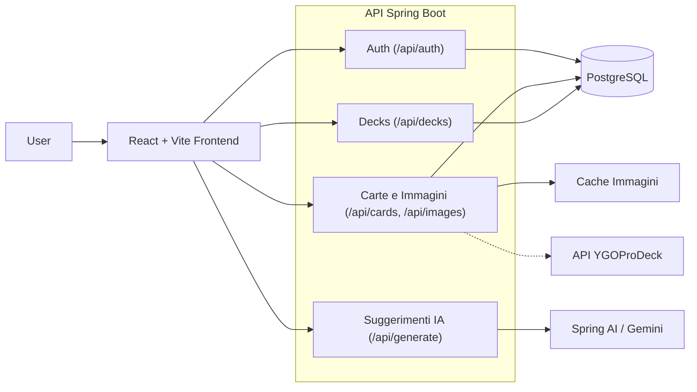

# DeckLab

[English](README.md) | **Italiano**

[](https://github.com/andrea-pugliatti/deck-lab/actions/workflows/ci.yml)
[](https://github.com/andrea-pugliatti/deck-lab/actions/workflows/deploy.yml)
[](LICENSE)

DeckLab è un deck builder, simulatore e strumento strategico per Yu-Gi-Oh! Provalo su [decklab.games](https://decklab.games). Il progetto combina un frontend in React + Vite con un backend in Spring Boot e persistenza PostgreSQL. È nato come progetto di apprendimento per esplorare pattern di sviluppo full-stack, Spring Boot, React e integrazioni con l'IA generativa. E alla fine è qualcosa che uso ancora ogni giorno.

## Funzionalità Chiave

- Deck builder con sezioni per Main, Extra e Side deck
- Validazione della legalità in tempo reale per vari formati
- Flussi assistiti dall'IA per la generazione di deck e suggerimenti di carte
- Ricerca delle carte con filtri per nome, archetipo, tipo, attributo e razza
- Simulatore di mano iniziale e analisi di consistenza del deck
- Autenticazione JWT con rotazione del refresh token e protezione contro il replay
- Configurazione di sviluppo Docker Compose per l'orchestrazione locale

## Stack Tecnologico

- **Backend**: Java 25, Maven, Spring Boot 4.1, Spring Data JPA, Spring Security, Spring AI (Integrazione Gemini)
- **Database**: PostgreSQL 18
- **Frontend**: React 19, Lucide React, TypeScript, Vite 8, Tailwind CSS 4, React Router 8, Oxlint (linting), Oxfmt (formattazione), pnpm
- **Mobile**: Flutter 3, Dart 3, Riverpod, GoRouter, Dio, CachedNetworkImage
- **Infrastruttura & Cloud**: OpenTofu/Terraform (IaC per GCP Cloud Run, Cloud SQL, Cloud Storage, Artifact Registry), Docker Compose
- **Test Frontend**: Vitest, React Testing Library
- **Test Backend**: JUnit, Mockito
- **Test Mobile**: Flutter Test

---

## Anteprima

### Home Page


### Card Database


### Public Decks


### Deck Builder


### Hand Simulator


---

## Struttura delle Directory e Architettura

Il codice è suddiviso in moduli distinti. Frontend, backend, applicazione mobile e infrastruttura sono separati per responsabilità:

```text
deck-lab/
├── .github/
│   └── workflows/
│       ├── ci.yml           # CI pipeline (backend/frontend/mobile build and tests)
│       ├── deploy.yml       # CD pipeline (GCP deployment setup)
│       └── mobile-release.yml # Mobile release workflow
├── backend/
│   ├── src/main/java/
│   │   └── com/deck/lab/backend/
│   │       ├── config/          # Application configuration and startup setup
│   │       ├── controller/      # Auth, card, deck, and AI-related endpoints
│   │       ├── dto/             # Request/response payloads and validation models
│   │       ├── exception/       # Global exception handling and custom errors
│   │       ├── mapper/          # DTO-to-entity and entity-to-DTO mapping layers
│   │       ├── model/           # Core database entities (User, Card, Deck, RefreshToken)
│   │       ├── repository/      # Spring Data repositories and specifications
│   │       ├── security/        # JWT, filters, and authentication configuration
│   │       ├── seeder/          # Database seeders for cards, banlists, and sample users
│   │       ├── service/         # Business logic for decks, validation, and auth
│   │       │   └── generation/  # AI deck generation & suggestion module
│   │       │       ├── model/   # Mapped AI prompt & response schemas
│   │       │       ├── tool/    # Registered Spring AI function callbacks
│   │       │       └── tool/dto/# Payload requests/responses used by AI tools
│   │       └── validation/      # Deck legality and rule-validation engine
│   ├── src/main/resources/
│   │   ├── application.yml      # Core backend configuration
│   │   └── static/              # Static assets served by the backend
│   └── src/test/java/           # Backend unit and integration tests
├── frontend/
│   ├── src/assets/              # Static assets and global icons
│   ├── src/components/          # Reusable UI widgets and feature modules
│   │   ├── card/                # Card grid elements and filter sidebars
│   │   ├── deck/                # Deck grid items and card lists
│   │   ├── deck-builder/        # Deck editor, validation alerts, and AI suggestions
│   │   │   └── ai-wizard/       # AI deck builder wizard flow
│   │   ├── hand-simulator/      # Probability calculators and simulator workspace
│   │   └── ui/                  # Core input and display primitives
│   ├── src/context/             # Auth, catalog search, and deck state providers
│   ├── src/hooks/               # Custom hooks for URL sync, fetch lifecycle, and metadata access
│   ├── src/layouts/             # Route wrappers for authenticated and public layouts
│   ├── src/pages/               # High-level route entry points
│   ├── src/reducers/            # Reducers for deck editing and simulator state
│   ├── src/services/            # REST API clients and JWT helpers
│   ├── src/test/                # Vitest test environment and setup files
│   ├── src/types/               # Shared TypeScript interfaces and schemas
│   └── src/utils/               # Utility helpers for math, formatting, and themed visuals
├── mobile/
│   ├── lib/
│   │   ├── data/                # Remote API repositories and mappers (Dio)
│   │   ├── domain/              # Domain models and repository interfaces
│   │   ├── navigation/          # GoRouter navigation and stateful tabs
│   │   └── ui/                  # Feature views, view models (Riverpod), and widgets
│   └── test/                    # Mobile unit, widget, and architecture tests
├── infra/                       # OpenTofu IaC modules for GCP
├── bruno/                       # API request collection for local development
├── .env.example                 # Template for environment configuration variables
├── docker-compose.yml           # Local orchestration for db, backend, and frontend
├── LICENSE                      # MIT License file
└── README.md                    # Project overview and development guide
```

### Panoramica del Flusso di Richiesta


```mermaid
flowchart LR
    User --> Frontend[React + Vite Frontend]

    subgraph API [API Spring Boot]
        Auth["Auth (/api/auth)"]
        Cards["Carte e Immagini (/api/cards, /api/images)"]
        Decks["Decks (/api/decks)"]
        Gen["Suggerimenti IA (/api/generate)"]
    end

    Frontend --> Auth
    Frontend --> Cards
    Frontend --> Decks
    Frontend --> Gen

    Auth --> DB[(PostgreSQL)]
    Cards --> DB
    Decks --> DB

    Cards --> Cache[Cache Immagini]
    Gen --> AI[Spring AI / Gemini]

    Cards -.-> YGO[API YGOProDeck]
```

### Concetti Chiave

#### Gestione dello Stato

- Lo stato locale del componente gestisce i comportamenti focalizzati della UI.
- Lo stato condiviso risiede in React Context e reducers per la modifica dei deck, la simulazione della mano e lo stato di ricerca/query.
- Il frontend mantiene lo stato UX. Il backend è la fonte di verità per persistenza e validazione.

#### Hook Custom

- Gli hook di sincronizzazione dell'URL mantengono lo stato di ricerca e filtro nella barra degli indirizzi, così i link ai deck sono condivisibili e salvabili nei segnalibri.
- Gli hook di fetching incapsulano gli stati di caricamento ed errore per le chiamate API e le ricerche di metadati.

#### Validazione della Legalità del Deck

- **Pipeline di Validazione**: Il backend verifica i deck contro regole composite (`DeckRule`): limiti di quantità (max 3 copie), posizionamento per tipo (mostri Fusion/Synchro/Link solo nell'Extra Deck) e dimensioni del deck (limiti per Main, Extra e Side).
- **Regole del formato**: Il validatore estrae le banlist (Advanced, Goat, Edison, ecc.) dal database e applica le restrizioni in tempo reale.

#### Suggerimenti e Generazione IA

- **Prompt Strutturati**: Il backend usa il client chat di Spring AI per interfacciarsi con Gemini. Utilizza modelli di output strutturato per generare deck list e suggerimenti di carte in base all'archetipo o alla strategia scelta dall'utente.
- **Function Calling di Spring AI**: Il backend incapsula l'accesso al database e alle regole di business tramite funzioni di callback registrate nel sotto-pacchetto `tool/` (`CardSearchTool`, `CardDetailsTool`, `GetFormatRulesTool`, `GetArchetypeCardsTool` e `AnalyzeDeckStatsTool`). Ogni strumento usa i propri parametri di richiesta/risposta isolati dal pacchetto `tool/dto/` per contenere le dimensioni del contesto.
- **Ricerca Contestuale**: Il backend mappa gli output dell'IA su DTO JSON in `model/` (`CardEntry`, `DeckGenerateAiResponse`) e li risolve nel database PostgreSQL locale con `CardResolver`. È così che ci assicuriamo che ogni nome di carta generato esista davvero nel catalogo.

#### Seeding Asincrono e Graceful Shutdown

Il seeding scarica un gran set di dati senza bloccare l'avvio, e questo conta su piattaforme serverless come Google Cloud Run:

- **Avvio non bloccante**: Il seeding gira su un esecutore dedicato a thread singolo (`databaseSeederExecutor`), così il thread principale si lega alla porta e passa i probe del container in fretta.
- **Validazione delle immagini all'avvio**: Anche con un database già popolato, il seeder scansiona ogni record e lo confronta con i file su disco. Le illustrazioni mancanti vanno in coda per un download in background.
- **Interruzione graduale**: Nei ridimensionamenti, nelle nuove distribuzioni o nei riavvii del container, l'hook `@PreDestroy` di Spring segnala al thread del seeder di fermarsi, interrompendo download in corso e scritture batch.
- **Download asincroni degli artwork**: Un pool `imageDownloadExecutor` con un gestore di rifiuto `CallerRunsPolicy` gestisce i download. Quando il pool si riempe, quel gestore spinge il lavoro indietro al thread di seeding e lo rallenta. All'arresto del contesto scarta il resto. Nessun `RejectedExecutionException`.

---

## Per Iniziare

### Prerequisiti

- Docker o Podman
- Java JDK 25
- Node.js 22+ (testato con la versione 24 in CI)
- pnpm

### Configurazione dell'Ambiente

Prima di avviare l'applicazione, prepara la configurazione dell'ambiente:

```bash
cp .env.example .env
```

Il file `.env.example` contiene le seguenti variabili:

| Variabile            | Richiesta | Predefinito     | Descrizione                                   |
| -------------------- | --------- | --------------- | --------------------------------------------- |
| `POSTGRES_USER`      | No        | `postgres`      | Utente del database                           |
| `POSTGRES_PASSWORD`  | No        | `postgres`      | Password del database                         |
| `JWT_SECRET`         | No        | Chiave dev int. | Chiave di firma HMAC per i JWT                |
| `GEMINI_API_KEY`     | **Sì**    | —               | Chiave API per le funzionalità basate su IA   |
| `PRODUCTION_API_URL` | No        | —               | Necessaria solo per le pipeline di deployment |

### Sviluppo

#### Opzione 1: Avvia con Docker Compose

Dalla directory radice del repository:

```bash
docker compose up -d
```

Questo avvia:

- `db`: PostgreSQL 16
- `backend`: App Spring Boot sulla porta 8080 (carica le variabili da `.env`)
- `frontend`: Server di sviluppo Vite sulla porta 5173

##### Sviluppo con Compose Watch

La configurazione Compose supporta **Docker Compose Watch** per l'hot reload e la sincronizzazione dei file. Per eseguire i servizi con sincronizzazione e ricostruzioni automatiche esegui:

```bash
docker compose watch
```

#### Opzione 2: Esegui i servizi manualmente

Per eseguire i servizi manualmente, devi prima avviare PostgreSQL. Avvia solo il container del database con:

```bash
docker compose up -d db
```

##### Backend

Imposta le variabili d'ambiente necessarie nella tua shell. Spring Boot non carica `.env` quando viene eseguito manualmente, quindi esporta le variabili o fatti affidare ai valori predefiniti su localhost. Quindi esegui:

```bash
cd backend
./mvnw spring-boot:run
```

##### Frontend

```bash
cd frontend
pnpm install
pnpm run dev
```

Apri il frontend all'indirizzo `http://localhost:5173`.

### Altri Comandi

Esegui questi comandi dalle rispettive sottodirectory:

- Linting Frontend: `cd frontend && pnpm run lint` (utilizza Oxlint)
- Controllo formattazione Frontend: `cd frontend && pnpm run format:check` (utilizza Oxfmt)
- Correzione formattazione Frontend: `cd frontend && pnpm run format` (utilizza Oxfmt)
- Test Frontend: `cd frontend && pnpm run test` oppure `cd frontend && pnpm run test:run` (utilizza Vitest)
- Test Backend: `cd backend && ./mvnw test`

## Configurazione del Backend

Le impostazioni principali sono in `backend/src/main/resources/application.yml`, con fallback nel codice:

- `spring.datasource.url`: URL di connessione al database
- `spring.ai.google.genai.api-key`: Chiave API Gemini per funzionalità IA (valore predefinito: `${GEMINI_API_KEY}`)
- `spring.ai.google.genai.chat.model`: Versione del modello utilizzata per i task GenAI (valore predefinito: `gemini-3.1-flash-lite`)
- `jwt.secret`: Chiave di firma HMAC per l'autenticazione JWT
- `jwt.expiration`: Durata di scadenza del token in millisecondi
- `refresh-token.duration-days`: Durata di vita del refresh token in giorni
- `refresh-token.max-per-user`: Limite di sessioni concorrenti per utente
- `refresh-token.cleanup-schedule`: Espressione cron per eliminare i refresh token scaduti
- `refresh-token.grace-period-seconds`: Periodo di tolleranza per la sostituzione del token in secondi
- `app.upload-dir`: Cartella di destinazione per le immagini delle carte in cache
- `app.seed.cards`: Flag per caricare i dati delle carte da YGOPRODeck all'avvio
- `app.seed.users`: Flag per creare utenti amministratori e di prova all'avvio (configurato nel codice, valore predefinito: true)
- `app.ygoprodeck.api-url`: Endpoint sorgente per i dati del catalogo carte (configurato nel codice, valore predefinito: API YGOPRODeck v7)

### Variabili d'Ambiente di Docker/Sistema

- `DB_HOST`: Indirizzo host del database (valore predefinito: `localhost`, o `db` all'interno di Docker)
- `POSTGRES_USER`: Utente del database (valore predefinito: `postgres`)
- `POSTGRES_PASSWORD`: Password del database (valore predefinito: `postgres`)
- `IMAGE_UPLOAD_DIR`: Percorso per salvare le illustrazioni delle carte
- `GEMINI_API_KEY`: Chiave API richiesta per l'integrazione di Spring AI
- `ALLOWED_CORS_ORIGINS`: Domini client consentiti per gli header CORS
- `JWT_SECRET`: Override del segreto personalizzato per le firme dei token
- `VITE_API_URL`: URL API di base utilizzato dal proxy del server di sviluppo Vite (punta a http://backend:8080 all'interno di Docker Compose, o http://localhost:8080 per lo sviluppo locale su host)
- `PRODUCTION_API_URL`: Variabile ridondante definita per le pipeline di deployment (il bundle di produzione utilizza solo percorsi `/api` relativi gestiti dal load balancer cloud)

## Comportamento del Backend

A meno che i flag `app.seed.cards` e `app.seed.users` non siano impostati su false, all'avvio il backend provvederà a:

- inserire i dati delle carte dalle API di YGOPRODeck
- verificare e scaricare le illustrazioni mancanti delle carte nella cartella di archiviazione configurata (es. `backend/data/images`)
- inserire le banlist dei formati
- creare deck di esempio e account utente predefiniti

Gli account predefiniti inseriti sono:

| Username | Password   | Email               |
| -------- | ---------- | ------------------- |
| `admin`  | `12345678` | `admin@example.com` |
| `yugi`   | `12345678` | `yugi@example.com`  |

## Utilizzo della Collezione API

La cartella `bruno/` contiene una collezione Bruno per testare le API localmente. È comodo per:

- testare i flussi di autenticazione come login e logout
- creare e convalidare i deck tramite le API
- esplorare gli endpoint delle carte e dei deck senza creare un client personalizzato
- verificare rapidamente il comportamento del backend mentre le modifiche al frontend sono in corso

Per utilizzarla:

1. Apri Bruno e importa la collezione dalla directory `bruno/`.
2. Seleziona l'ambiente `Local` per indirizzare le richieste al tuo backend locale.
3. Avvia il backend ed esegui le richieste direttamente da Bruno per ispezionare risposte e payload.

## Risoluzione dei Problemi

- Se il frontend non riesce a raggiungere il backend, verifica che il container del backend sia in esecuzione e che `VITE_API_URL` punti all'origine corretta.
- Se il backend non si avvia, conferma che PostgreSQL sia raggiungibile e che le variabili d'ambiente come `GEMINI_API_KEY` siano impostate.
- Se riscontri conflitti di porta, interrompi i servizi che usano le porte `5173`, `8080` o `5432` prima di riavviare lo stack.
- Per ripristinare lo stato locale, esegui `docker compose down -v` per partire da un database pulito. Il flag `-v` rimuove i volumi nominati (incluso il database).

## CI/CD & Deployment

- **Continuous Integration (`ci.yml`)**: Attivata su pull request e push su `main`, `master` e `**/feature/**`. Esegue controlli di linting/formattazione sul frontend, test Maven sul backend e compila gli artefatti.
- **Continuous Deployment (`deploy.yml`)**: Attivata in seguito a un push su `main` (o eseguita manualmente tramite workflow dispatch). Si autentica su Google Cloud con Workload Identity Federation (WIF) e avvia questa pipeline:
  1. Compila e invia l'immagine del backend all'Artifact Registry.
  2. Distribuisce il backend su Cloud Run, montando un bucket Cloud Storage per le immagini delle carte e collegando Cloud SQL.
  3. Compila il frontend in produzione e copia gli asset statici in un bucket Cloud Storage.
  4. Invalida la cache Cloud CDN.

Per attivare la pipeline CD nel tuo repository GitHub, configura questi segreti e variabili:

| Tipo       | Nome                           | Descrizione                                                                                              |
| ---------- | ------------------------------ | -------------------------------------------------------------------------------------------------------- |
| **Secret** | `GCP_WIF_PROVIDER`             | Identificatore completo del Workload Identity Provider                                                   |
| **Secret** | `GCP_WIF_SERVICE_ACCOUNT`      | Email del Service Account di deployment in GCP                                                           |
| **Secret** | `GCP_CLOUDSQL_CONNECTION_NAME` | Nome di connessione dell'istanza Cloud SQL PostgreSQL                                                    |
| **Secret** | `DECK_LAB_DB_PASSWORD`         | Password per la connessione al database PostgreSQL                                                       |
| **Secret** | `DECK_LAB_GEMINI_API_KEY`      | Chiave API Gemini per Spring AI in produzione                                                            |
| **Secret** | `DECK_LAB_JWT_SECRET`          | Segreto di firma di produzione per i JWT                                                                 |
| **Secret** | `PRODUCTION_API_URL`           | Endpoint del servizio Cloud Run per l'accesso API del frontend (non compilato direttamente nel frontend) |
| **Secret** | `GCP_LOAD_BALANCER_NAME`       | Nome dell'url-map del Load Balancer HTTP(S) di GCP                                                       |
| **Secret** | `DB_USER`                      | Nome utente del database di produzione                                                                   |
| **Secret** | `ALLOWED_CORS_ORIGINS`         | Origini client consentite per CORS in produzione                                                         |
| **Secret** | `GCP_PROJECT_ID`               | ID del progetto GCP                                                                                      |
| **Secret** | `GCP_FRONTEND_BUCKET_NAME`     | Nome del bucket Google Cloud Storage per l'hosting statico del frontend                                  |
| **Secret** | `GCP_IMAGE_BUCKET_NAME`        | Nome del bucket Google Cloud Storage per l'archiviazione delle immagini delle carte del backend          |

## Licenza

Questo progetto è distribuito sotto la Licenza MIT - vedi il file [LICENSE](LICENSE) per i dettagli.
