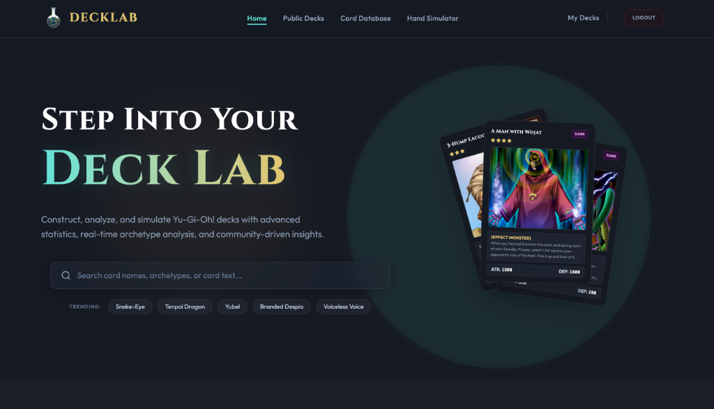
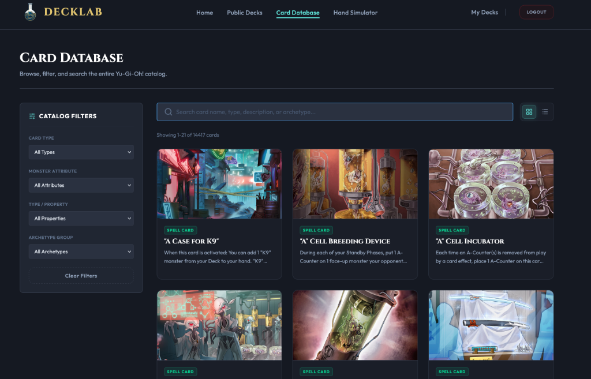
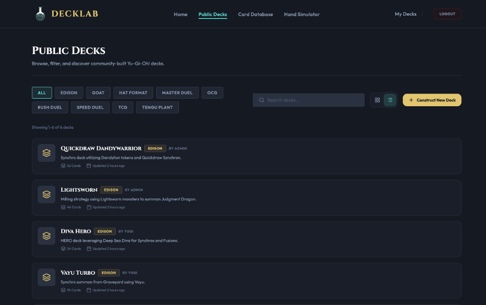
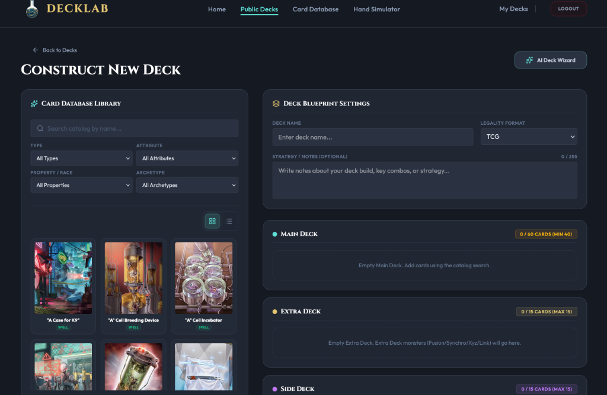
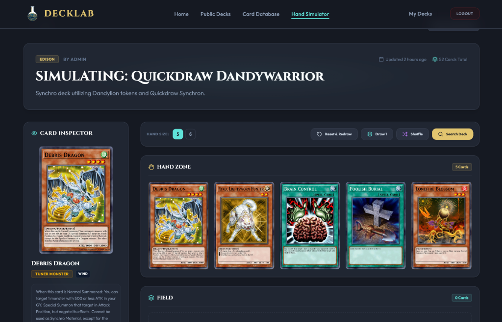
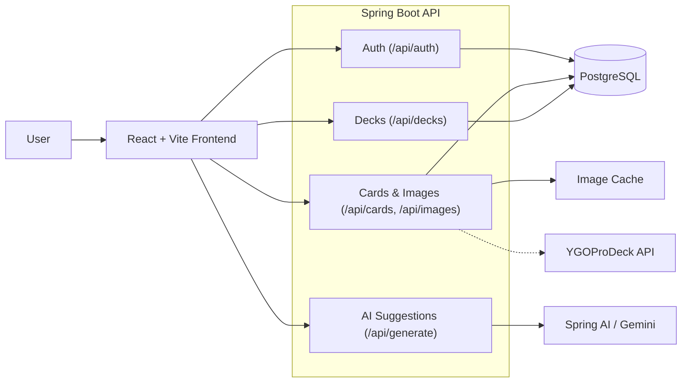

# DeckLab

**English** | [Italiano](README.it.md)

[](https://github.com/andrea-pugliatti/deck-lab/actions/workflows/ci.yml)
[](https://github.com/andrea-pugliatti/deck-lab/actions/workflows/deploy.yml)
[](LICENSE)

DeckLab is a full-stack Yu-Gi-Oh! deck builder, simulator, and AI-assisted strategy tool designed to help players build and refine decks in a single workflow. Play it live at [decklab.games](https://decklab.games). The project combines a React + Vite frontend with a Spring Boot backend and PostgreSQL persistence so that deck editing, legality checks, AI suggestions, and account-backed storage all work together seamlessly. This application was built as a hands-on learning experience to explore full-stack development patterns, Spring Boot, React, and generative AI integrations.

## Key Features

- Deck builder with Main, Extra, and Side deck sections
- Real-time legality validation across multiple formats
- AI-assisted deck generation and card suggestion flows
- Card search with filters for name, archetype, type, attribute, and race
- Starting hand draw simulation and deck consistency analytics
- JWT authentication with refresh token rotation and replay protection
- Docker Compose development setup for local orchestration

## Tech Stack

- **Backend**: Java 25, Maven, Spring Boot 4.1, Spring Data JPA, Spring Security, Spring AI (Gemini Integration)
- **Database**: PostgreSQL
- **Frontend**: React 19, Lucide React, TypeScript, Vite 8, Tailwind CSS 4, React Router 8, Oxlint (linting), Oxfmt (formatting), pnpm
- **Frontend Testing**: Vitest, React Testing Library
- **Backend Testing**: JUnit, Mockito

---

## Preview

### Home Page



### Card Database



### Public Decks



### Deck Builder



### Hand Simulator



---

## Directory Structure & Architecture

The application is organized into modular layers so the frontend and backend stay focused on their responsibilities:

```text
deck-lab/
├── .github/
│   └── workflows/
│       ├── ci.yml           # CI pipeline (backend/frontend build and tests)
│       └── deploy.yml       # CD pipeline (GCP deployment setup)
├── backend/
│   ├── src/main/java/
│   │   └── com/deck/lab/backend/
│   │       ├── config/          # Application configuration and startup setup
│   │       ├── controller/      # Auth, card, deck, and AI-related endpoints
│   │       ├── dto/             # Request/response payloads and validation models
│   │       ├── exception/       # Global exception handling and custom errors
│   │       ├── mapper/          # DTO-to-entity and entity-to-DTO mapping layers
│   │       ├── model/           # Core database entities (User, Card, Deck, RefreshToken)
│   │       ├── repository/      # Spring Data repositories and specifications
│   │       ├── security/        # JWT, filters, and authentication configuration
│   │       ├── seeder/          # Database seeders for cards, banlists, and sample users
│   │       ├── service/         # Business logic for decks, validation, and auth
│   │       │   └── generation/  # AI deck generation & suggestion module
│   │       │       ├── model/   # Mapped AI prompt & response schemas
│   │       │       ├── tool/    # Registered Spring AI function callbacks
│   │       │       └── tool/dto/# Payload requests/responses used by AI tools
│   │       └── validation/      # Deck legality and rule-validation engine
│   ├── src/main/resources/
│   │   ├── application.yml      # Core backend configuration
│   │   └── static/              # Static assets served by the backend
│   └── src/test/java/           # Backend unit and integration tests
├── frontend/
│   ├── src/assets/              # Static assets and global icons
│   ├── src/components/          # Reusable UI widgets and feature modules
│   │   ├── card/                # Card grid elements and filter sidebars
│   │   ├── deck/                # Deck grid items and card lists
│   │   ├── deck-builder/        # Deck editor, validation alerts, and AI suggestions
│   │   │   └── ai-wizard/       # AI deck builder wizard flow
│   │   ├── hand-simulator/      # Probability calculators and simulator workspace
│   │   └── ui/                  # Core input and display primitives
│   ├── src/context/             # Auth, catalog search, and deck state providers
│   ├── src/hooks/               # Custom hooks for URL sync, fetch lifecycle, and metadata access
│   ├── src/layouts/             # Route wrappers for authenticated and public layouts
│   ├── src/pages/               # High-level route entry points
│   ├── src/reducers/            # Reducers for deck editing and simulator state
│   ├── src/services/            # REST API clients and JWT helpers
│   ├── src/test/                # Vitest test environment and setup files
│   ├── src/types/               # Shared TypeScript interfaces and schemas
│   └── src/utils/               # Utility helpers for math, formatting, and themed visuals
├── bruno/                       # API request collection for local development
├── .env.example                 # Template for environment configuration variables
├── docker-compose.yml           # Local orchestration for db, backend, and frontend
├── LICENSE                      # MIT License file
└── README.md                    # Project overview and development guide
```

### Request Flow Overview



### Core Concepts

#### State Management

- Local component state is used for focused UI behavior.
- Shared state is managed with React Context and reducers for deck editing, hand simulation, and search/query state.
- The frontend keeps user experience state lightweight while the backend remains the source of truth for persistence and validation.

#### Custom Hooks

- URL synchronization hooks keep search and filter state in the browser address bar so deck browsing remains shareable and bookmarkable.
- Fetching hooks encapsulate loading and error states for API calls and metadata lookups.

#### Deck Legality Validation

- **Validation Pipeline**: The backend runs decks through a validation engine containing composite rules (`DeckRule`) like card quantity limits (e.g., maximum 3 copies), proper card type placements (e.g., Fusion/Synchro/Link monsters in the Extra Deck), and deck size boundaries (Main, Extra, and Side deck limits).
- **Format-Specific Enforcement**: The validation engine fetches format legality mappings dynamically from database banlists (Advanced, Goat, Edison, etc.) to check card restrictions in real-time.

#### AI Suggestion & Generation

- **Structured Prompts**: The backend leverages Spring AI's chat client to interface with Gemini. It uses structured output models to construct cohesive deck lists and card suggestions matching a user's chosen archetype or strategy constraints.
- **Spring AI Function Calling**: External database and business-rule access is encapsulated via registered callback functions inside the `tool/` sub-package (e.g., `CardSearchTool`, `CardDetailsTool`, `GetFormatRulesTool`, `GetArchetypeCardsTool`, and `AnalyzeDeckStatsTool`), each utilizing isolated request/response parameters from the `tool/dto/` package to preserve context size limits.
- **Contextual Search & Resolution**: AI outputs are mapped to structured JSON DTOs defined in `model/` (like `CardEntry` and `DeckGenerateAiResponse`) and resolved against the local PostgreSQL database using the `CardResolver` to guarantee generated card names exist in the catalog.

#### Asynchronous Seeding & Graceful Shutdown

To handle large dataset imports safely without blocking application startup (especially important on serverless platforms like Google Cloud Run):

- **Non-Blocking Startup**: Database seeding is offloaded to a dedicated, single-threaded task executor (`databaseSeederExecutor`) so that the main thread can quickly bind to the required port and pass container startup probes.
- **Startup Image Validation**: Even if the database has already been populated with card records, the seeder scans all records and compares them against files on disk. Any missing card illustrations are queued for background download asynchronously.
- **Graceful Interruption**: During scale-downs, redeployments, or container restarts, Spring's `@PreDestroy` hook triggers an interrupt signal to the seeder thread, allowing it to halt any current card retrieval loops or batch database writes cleanly.
- **Async Artwork Downloads**: Artwork downloads are processed by a pooled `imageDownloadExecutor` configured with a `CallerRunsPolicy` rejection handler. This applies natural backpressure to the seeding thread when the pool is saturated, and discards any remaining tasks gracefully upon context shutdown without throwing `RejectedExecutionException`.

---

## Getting Started

### Prerequisites

- Docker or Podman
- Java JDK 25
- Node.js 22+ (tested with 24 in CI)
- pnpm

### Environment Configuration

Before running the application, prepare your environment configuration:

```bash
cp .env.example .env
```

The `.env.example` file contains the following variables:

| Variable             | Required | Default          | Description                          |
| -------------------- | -------- | ---------------- | ------------------------------------ |
| `POSTGRES_USER`      | No       | `postgres`       | Database user                        |
| `POSTGRES_PASSWORD`  | No       | `postgres`       | Database password                    |
| `JWT_SECRET`         | No       | Built-in dev key | HMAC signing key for JWTs            |
| `GEMINI_API_KEY`     | **Yes**  | —                | API key for AI-powered features      |
| `PRODUCTION_API_URL` | No       | —                | Only needed for deployment pipelines |

### Development

#### Option 1: Start with Docker Compose

From the repository root:

```bash
docker compose up -d
```

This starts:

- `db` — PostgreSQL 16
- `backend` — Spring Boot app on port 8080 (loads env from `.env`)
- `frontend` — Vite dev server on port 5173

##### Live Development with Compose Watch

The Compose environment is preconfigured to support **Docker Compose Watch** for hot reloading and file syncing. To run container services with file syncing and auto-rebuilds enabled, run:

```bash
docker compose watch
```

#### Option 2: Run services manually

To run services manually, you must first have the PostgreSQL database running. You can run only the database container using:

```bash
docker compose up -d db
```

##### Backend

Set up the required environment variables in your shell (note that Spring Boot does not automatically load the `.env` file when run manually, so you must export the variables or rely on defaults if running on localhost), then run:

```bash
cd backend
./mvnw spring-boot:run
```

##### Frontend

```bash
cd frontend
pnpm install
pnpm run dev
```

Open the frontend at `http://localhost:5173`.

### Other Commands

Run these from their respective subdirectories:

- Frontend linting: `cd frontend && pnpm run lint` (uses Oxlint)
- Frontend formatting check: `cd frontend && pnpm run format:check` (uses Oxfmt)
- Frontend formatting fix: `cd frontend && pnpm run format` (uses Oxfmt)
- Frontend tests: `cd frontend && pnpm run test` or `cd frontend && pnpm run test:run` (uses Vitest)
- Backend tests: `cd backend && ./mvnw test`

## Backend Configuration

Important settings are defined in `backend/src/main/resources/application.yml` (or configured as fallbacks in code):

- `spring.datasource.url` — Database connection URL
- `spring.ai.google.genai.api-key` — Gemini API Key for AI features (defaults to `${GEMINI_API_KEY}`)
- `spring.ai.google.genai.chat.model` — Model version used for GenAI tasks (defaults to `gemini-3.1-flash-lite`)
- `jwt.secret` — HMAC signature key for JWT authentication
- `jwt.expiration` — Token expiration duration in milliseconds
- `refresh-token.duration-days` — Refresh token lifetime in days
- `refresh-token.max-per-user` — Session concurrency limit per user
- `refresh-token.cleanup-schedule` — Cron expression for clearing expired refresh tokens
- `refresh-token.grace-period-seconds` — Token replacement grace period in seconds
- `app.upload-dir` — Folder destination for cached card images
- `app.seed.cards` — Flag to seed cards from YGOPRODeck on startup
- `app.seed.users` — Flag to seed admin and sample users on startup (configured in code, defaults to true)
- `app.ygoprodeck.api-url` — External card catalog data source endpoint (configured in code, defaults to YGOProDeck api v7)

### Docker/System environment variables

- `DB_HOST` — Database address host (defaults to `localhost`, or `db` inside Docker)
- `POSTGRES_USER` — Database user (defaults to `postgres`)
- `POSTGRES_PASSWORD` — Database password (defaults to `postgres`)
- `IMAGE_UPLOAD_DIR` — Path to save card illustrations
- `GEMINI_API_KEY` — API Key required for Spring AI integration
- `ALLOWED_CORS_ORIGINS` — Allowed client domains for CORS headers
- `JWT_SECRET` — Custom secret override for token signatures
- `VITE_API_URL` — Base API URL used by the Vite development server proxy (points to http://backend:8080 inside Docker Compose, or http://localhost:8080 for host-local dev)
- `PRODUCTION_API_URL` — Redundant variable defined for deployment pipelines (the production bundle only uses relative `/api` paths handled by the cloud load balancer)

## Backend Behavior

Unless the flags `app.seed.cards` and `app.seed.users` are set to false, on startup the backend will:

- seed card data from the YGOPRODeck API
- verify and download missing card artwork under the configured storage directory (e.g. `backend/data/images`)
- seed format banlists
- create sample decks and default user accounts

The default seeded accounts are:

| Username | Password   | Email               |
| -------- | ---------- | ------------------- |
| `admin`  | `12345678` | `admin@example.com` |
| `yugi`   | `12345678` | `yugi@example.com`  |

## API Collection Usage

The repository includes a Bruno collection under the `bruno/` folder for exercising the app locally. It is useful for:

- testing authentication flows such as login and logout
- creating and validating decks through the API
- exploring card and deck endpoints without needing to build a custom client
- quickly verifying backend behavior while frontend changes are in progress

To use it:

1. Open Bruno and import the collection from the `bruno/` directory.
2. Select the `Local` environment file to point requests at your local backend.
3. Start the backend and run requests directly from Bruno to inspect responses and payloads.

## Troubleshooting

- If the frontend cannot reach the backend, verify that the backend container is running and that `VITE_API_URL` points to the correct origin.
- If the backend fails to start, confirm that PostgreSQL is reachable and that required environment variables such as `GEMINI_API_KEY` are set.
- If you see port conflicts, stop existing services that are using ports `5173`, `8080`, or `5432` before restarting the stack.
- To reset local state completely, run `docker compose down -v` and start again from a clean database. The `-v` flag removes named volumes (including the database).

## CI/CD & Deployment

- **Continuous Integration (`ci.yml`)**: Triggered on pull requests and pushes to `main`, `master`, and `**/feature/**`. Runs linting/formatting checks on the frontend, executes Maven tests on the backend, and builds the deployable artifacts.
- **Continuous Deployment (`deploy.yml`)**: Triggered on push to `main` (or run manually via workflow dispatch). Authenticates to Google Cloud using Workload Identity Federation (WIF) and performs the following pipeline:
  1. Builds and pushes the Backend Docker image to GCP Artifact Registry.
  2. Deploys the Backend to Google Cloud Run, mounting a Cloud Storage bucket for persistent card artwork image caching and hooking up Cloud SQL connection.
  3. Builds the frontend with production configurations and copies static assets to a Google Cloud Storage bucket.
  4. Invalidates the GCP Load Balancer Cloud CDN cache.

To enable the CD pipeline in your GitHub repository, configure the following secrets and variables:

| Type       | Name                           | Description                                                                                        |
| ---------- | ------------------------------ | -------------------------------------------------------------------------------------------------- |
| **Secret** | `GCP_WIF_PROVIDER`             | Full identifier of the Workload Identity Provider                                                  |
| **Secret** | `GCP_WIF_SERVICE_ACCOUNT`      | Email of the deployment Service Account in GCP                                                     |
| **Secret** | `GCP_CLOUDSQL_CONNECTION_NAME` | Connection name of the PostgreSQL Cloud SQL instance                                               |
| **Secret** | `DECK_LAB_DB_PASSWORD`         | Password for PostgreSQL database connection                                                        |
| **Secret** | `DECK_LAB_GEMINI_API_KEY`      | Gemini API Key for production Spring AI                                                            |
| **Secret** | `DECK_LAB_JWT_SECRET`          | Production signing secret for JWTs                                                                 |
| **Secret** | `PRODUCTION_API_URL`           | Cloud Run service endpoint URL for frontend API access (not directly compiled into frontend build) |
| **Secret** | `GCP_LOAD_BALANCER_NAME`       | Name of the GCP HTTP(S) Load Balancer url-map                                                      |
| **Secret** | `DB_USER`                      | Production database user name                                                                      |
| **Secret** | `ALLOWED_CORS_ORIGINS`         | Allowed client origins for production CORS                                                         |
| **Secret** | `GCP_PROJECT_ID`               | GCP Project ID                                                                                     |
| **Secret** | `GCP_FRONTEND_BUCKET_NAME`     | GCP Cloud Storage bucket name for frontend static hosting                                          |
| **Secret** | `GCP_IMAGE_BUCKET_NAME`        | GCP Cloud Storage bucket name for backend card image storage                                       |

## License

This project is licensed under the MIT License - see the [LICENSE](LICENSE) file for details.
