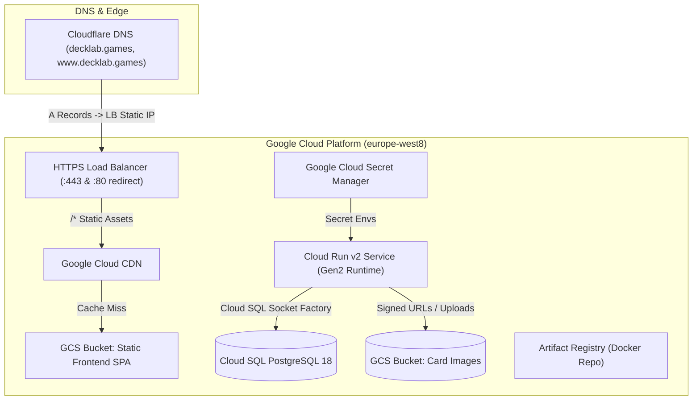

# DeckLab Infrastructure, Secrets, and DevOps Guide

This directory holds DeckLab's production **Infrastructure as Code (IaC)** in [OpenTofu](https://opentofu.org/), a provider-neutral Terraform engine. It defines the cloud stack on Google Cloud (`europe-west8`): an Artifact Registry, managed PostgreSQL, a static-frontend bucket, the Cloud Run backend backed by Cloud SQL, a global HTTPS load balancer with CDN, and Cloudflare DNS. It also records the variables and secrets each environment needs.

---

## Architecture Overview



---

## Infrastructure resources

| Module                   | Resources Provisioned                                                                                                                                                                                                                                                                                 | Purpose                                                                                                                                  |
| ------------------------ | ----------------------------------------------------------------------------------------------------------------------------------------------------------------------------------------------------------------------------------------------------------------------------------------------------- | ---------------------------------------------------------------------------------------------------------------------------------------- |
| `modules/registry`       | `google_artifact_registry_repository`                                                                                                                                                                                                                                                                 | Docker registry for backend container images with retention cleanup policies                                                             |
| `modules/database`       | `google_sql_database_instance` (PostgreSQL 18), `google_sql_database`, `google_sql_user`                                                                                                                                                                                                              | Managed PostgreSQL persistence (`POSTGRES_18`, `db-custom-2-8192`)                                                                       |
| `modules/storage`        | `google_storage_bucket` (frontend + images), `google_storage_bucket_iam_member`                                                                                                                                                                                                                       | Public SPA bucket (`deck-lab-frontend-prod`) and private card-images bucket (`deck-lab-images-prod`)                                     |
| `modules/backend`        | `google_cloud_run_v2_service`, `google_service_account`, `google_secret_manager_secret` x3, IAM bindings                                                                                                                                                                                              | Gen2 backend container with Secret Manager injection, GCS image volume mount, and Cloud SQL socket                                       |
| `modules/networking`     | `google_compute_global_address`, `google_certificate_manager_*`, `google_compute_region_network_endpoint_group`, `google_compute_backend_service`, `google_compute_backend_bucket`, `google_compute_url_map` x2, `google_compute_target_http(s)_proxy` x2, `google_compute_global_forwarding_rule` x2 | Global Load Balancer, Certificate Manager SSL, Serverless NEG routing `/api/*` to Cloud Run, Cloud CDN for SPA, and HTTP->HTTPS redirect |
| `modules/cloudflare_dns` | `cloudflare_dns_record` (`apex`, `www`, `acme_root`, `acme_www`)                                                                                                                                                                                                                                      | Automated DNS management in Cloudflare (A records + Google Certificate Manager ACME challenge CNAMEs)                                    |

---

## Quickstart & Local IaC Commands

### Prerequisites

1. **OpenTofu**: Install OpenTofu CLI (`brew install opentofu` or `tofu version >= 1.8.0`).
2. **GCP Authentication**: Authenticate locally with Application Default Credentials (ADC):
   ```bash
   gcloud auth application-default login
   ```
3. **Required GCP APIs**: Enable these APIs:
   ```bash
   gcloud services enable run.googleapis.com sqladmin.googleapis.com secretmanager.googleapis.com storage.googleapis.com artifactregistry.googleapis.com compute.googleapis.com iam.googleapis.com
   ```

### Execution Workflow

```bash
cd infra

# 1. Initialize OpenTofu (downloads google and cloudflare providers)
tofu init

# 2. Format & Validate
tofu fmt -recursive
tofu validate

# 3. Configure Variables
cp terraform.tfvars.example terraform.tfvars
# Edit terraform.tfvars with your GCP project ID and secrets (file is gitignored)

# 4. Plan & Apply
tofu plan -var-file=terraform.tfvars
tofu apply -var-file=terraform.tfvars
```

---

## Remote State Management

To share infrastructure state across team members and CI/CD pipelines:

1. The remote state backend is configured in [`backend.tf`](./backend.tf) pointing to `gs://deck-lab-tfstate`.
2. Initialize OpenTofu against the GCS backend:
   ```bash
   tofu init
   ```

---

## Secrets and Environment Variables Hierarchy

### 1. Local Development (`.env`)

Copy the root `.env.example` to `.env`. Docker Compose uses this single file:

```bash
cp .env.example .env
docker compose up -d
```

### 2. Google Cloud Secret Manager

In production, secrets live in Secret Manager and Cloud Run mounts them as environment variables:

| Secret Manager Secret ID  | Cloud Run Environment Variable | Description                               |
| ------------------------- | ------------------------------ | ----------------------------------------- |
| `DECK_LAB_DB_PASSWORD`    | `POSTGRES_PASSWORD`            | PostgreSQL user password                  |
| `DECK_LAB_JWT_SECRET`     | `JWT_SECRET`                   | 512-bit Base64 signing key for JWT tokens |
| `DECK_LAB_GEMINI_API_KEY` | `GEMINI_API_KEY`               | Google Gemini API key for AI generation   |

### 3. GitHub Actions Repository Secrets

The deploy workflow (`.github/workflows/deploy.yml`) needs these repository secrets set in **GitHub > Repository Settings > Secrets and variables > Actions**:

| GitHub Secret Name             | Description                             | Value / Note for `deck-lab`                                                            |
| ------------------------------ | --------------------------------------- | -------------------------------------------------------------------------------------- |
| `GCP_PROJECT_ID`               | Google Cloud Project ID                 | `deck-lab`                                                                             |
| `GCP_WIF_PROVIDER`             | Workload Identity Provider resource URI | `projects/123/locations/global/workloadIdentityPools/github/providers/github-provider` |
| `GCP_WIF_SERVICE_ACCOUNT`      | GitHub Actions deployer Service Account | `github-deployer@deck-lab.iam.gserviceaccount.com`                                     |
| `GCP_CLOUDSQL_CONNECTION_NAME` | Cloud SQL instance connection string    | `deck-lab:europe-west8:deck-lab-db`                                                    |
| `GCP_FRONTEND_BUCKET_NAME`     | GCS frontend static assets bucket name  | `deck-lab-frontend-prod`                                                               |
| `GCP_IMAGE_BUCKET_NAME`        | GCS card images bucket name             | `deck-lab-images-prod`                                                                 |
| `GCP_LOAD_BALANCER_NAME`       | GCP URL map name for CDN invalidation   | `deck-lab-lb`                                                                          |
| `DB_USER`                      | PostgreSQL application user             | `postgres`                                                                             |
| `ALLOWED_CORS_ORIGINS`         | Comma-separated allowed CORS origins    | `https://decklab.games,https://www.decklab.games`                                      |

---

## Cloudflare DNS Configuration

Cloudflare manages DNS for `decklab.games`.

### Option A: Automated via OpenTofu

Configure the following in `terraform.tfvars`:

```hcl
enable_cloudflare_dns = true
cloudflare_zone_id    = "<CLOUDFLARE_ZONE_ID>"
cloudflare_api_token  = "<CLOUDFLARE_API_KEY>" # Token with Zone.DNS:Edit permissions
```

OpenTofu automatically provisions and synchronizes:

- Apex `@` `A` record $\rightarrow$ `136.69.60.226` (`proxied = true`)
- Subdomain `www` `A` record $\rightarrow$ `136.69.60.226` (`proxied = true`)
- Google Certificate Manager ACME challenge `CNAME` records (`_acme-challenge` and `_acme-challenge.www`) for zero-touch SSL renewal.

### Option B: Manual via Cloudflare Dashboard

If `enable_cloudflare_dns = false`:

1. **Retrieve the Load Balancer IP**:
   ```bash
   cd infra && tofu output lb_ip_address
   ```
2. **Add DNS Records in Cloudflare Dashboard**:
   - **Apex record**: Type `A`, Name `@`, Content `<lb_ip_address>`, Proxy status: `Proxied` (Orange cloud).
   - **WWW record**: Type `A`, Name `www`, Content `<lb_ip_address>`, Proxy status: `Proxied` (Orange cloud).
3. **SSL/TLS Setting in Cloudflare**:
   - Set encryption mode to **Full (strict)** or **Full**.

---

## Mobile Build Configuration (`--dart-define`)

When building the Flutter mobile application for release, pass the production API base URL:

```bash
cd mobile
flutter build apk --release --dart-define=API_BASE_URL=https://decklab.games/api
```

In local development, `ApiClient` automatically detects Android Emulator (`10.0.2.2:8080`) or iOS Simulator (`localhost:8080`).

---

## Secret Rotation Playbooks

### Rotating JWT Secret

1. Generate a new 512-bit base64 key:
   ```bash
   NEW_KEY=$(openssl rand -base64 64 | tr -d '\n')
   ```
2. Add a new secret version in Google Secret Manager:
   ```bash
   echo -n "$NEW_KEY" | gcloud secrets versions add DECK_LAB_JWT_SECRET --data-file=- --project=deck-lab
   ```
3. Update `jwt_secret` in `infra/terraform.tfvars`.
4. Deploy a new revision of Cloud Run to pick up the new secret version:
   ```bash
   gcloud run services update backend-service --region=europe-west8 --project=deck-lab --update-secrets=JWT_SECRET=DECK_LAB_JWT_SECRET:latest
   ```

### Rotating Database Password

1. Generate a strong password:
   ```bash
   NEW_DB_PASS=$(openssl rand -base64 32 | tr -d '\n')
   ```
2. Update database user password in Cloud SQL:
   ```bash
   gcloud sql users set-password postgres --instance=deck-lab-db --password="$NEW_DB_PASS" --project=deck-lab
   ```
3. Add new version to Secret Manager:
   ```bash
   echo -n "$NEW_DB_PASS" | gcloud secrets versions add DECK_LAB_DB_PASSWORD --data-file=- --project=deck-lab
   ```
4. Update `db_password` in `infra/terraform.tfvars`.
5. Deploy or restart Cloud Run so it connects using the updated credentials.
